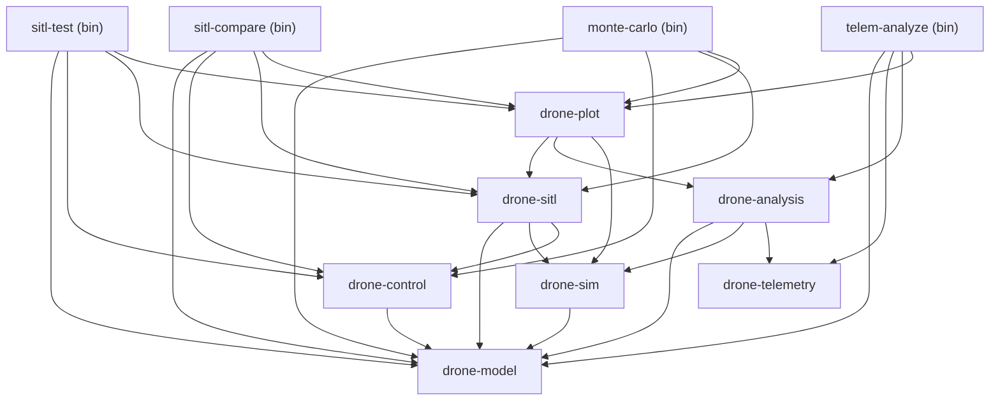

# drone-sim Architecture

## 1. Project Overview

**drone-sim** is a 6DOF (six degrees of freedom) flight simulator written in Rust. It supports two vehicle models:

- **DJI Mini 3 Quadrotor** — X-frame quadcopter with first-order motor dynamics and quadratic drag.
- **F-16A** — combat aircraft with NASA TP-1538 aerodynamic model, F110 turbojet engine, and a full table of aerodynamic coefficients.

The project implements the full simulation pipeline: physical model → state derivatives → numerical integrator → state → controller → actuator input → back to model.

---

## 2. Workspace Structure

The workspace consists of **7 library crates** and **4 binary crates**.

### Library crates (`crates/`)

- **`drone-model`** — physics core: drone state (`DroneState`), vehicle models (`VehicleModel`), 6DOF dynamics, motors, math (ISA atmosphere, Euler angles), `TimeStep` wrapper.
- **`drone-control`** — flight controllers: PID, cascade PID, LQR, LQI, mixers (quadrotor/fixed-wing), velocity profilers, trajectories, `Controller` trait.
- **`drone-sim`** — simulation engine: `Integrator` trait (Euler, RK4), main runner (`run`), `SimConfig` configuration.
- **`drone-sitl`** — SITL (Software-In-The-Loop): TOML scenarios, scenario runner, disturbances (wind, turbulence, motor failure), metrics, controller comparisons, Monte Carlo, reports.
- **`drone-telemetry`** — DJI SRT telemetry file parser, GPS→ENU conversion, trajectory normalisation.
- **`drone-analysis`** — model validation: trajectory alignment, simulation vs. telemetry comparison, validation reports.
- **`drone-plot`** — PNG chart generation (scenarios, comparisons, Monte Carlo, validation) using the `plotters` library.

### Binary crates (`bin/`)

- **`sitl-test`** — runs SITL scenarios with a chosen controller (Cascade/LQR/LQI), checks assertions, optionally generates charts.
- **`sitl-compare`** — compares multiple controllers side-by-side on the same scenarios, generates a metrics table and Markdown reports.
- **`telem-analyze`** — validates the physical model against real DJI SRT telemetry, exports CSV and charts.
- **`monte-carlo`** — runs batches of Monte Carlo simulations with perturbed initial conditions, reports metric statistics.

---

## 3. Dependency Graph



The `drone-model` and `drone-telemetry` crates have no internal dependencies — they are leaves of the graph. The `drone-plot` crate sits highest in the library hierarchy, depending on `drone-sitl`, `drone-analysis`, and `drone-sim`.

---

## 4. Data Flow

The simulation loop at each time step `dt`:

```
┌─────────────────────────────────────────────────────────────┐
│                      Simulation Step                        │
│                                                             │
│  1. Controller.update(state, target, dt) → ActuatorInput    │
│  2. VehicleModel.step_actuators(state, input, dt)           │
│     (first-order motor dynamics)                            │
│  3. VehicleModel.derivatives(state, input) → StateDot       │
│     (aero forces + gravity → 6DOF dynamics)                 │
│  4. Integrator.step(model, state, input, dt) → new state    │
│     (Euler or RK4)                                          │
│  5. state = new state; time += dt                           │
└─────────────────────────────────────────────────────────────┘
```

In detail:

1. The **controller** computes the actuator input (`KnownActuatorInput`) from the current state and flight target.
2. **Actuator dynamics** (`step_actuators`) — a first-order filter modelling motor lag (quadrotor) or turbine spool-up (F-16). Updates the `actuator_state` field in `DroneState`.
3. The **vehicle model** (`derivatives`) computes state derivatives: aerodynamic forces → forces and moments in the body frame → `dynamics_6dof` (translation + rotation + quaternion derivative).
4. The **integrator** (`Euler` or `RK4`) applies the derivatives to the state, renormalising the quaternion after each step.

In the SITL loop, **disturbances** (wind gusts, turbulence, motor failure) are applied at the start of each step.

---

## 5. Conventions

### Coordinate Frame
- **ENU** (East-North-Up): x = east, y = north, **z = up**.
- Gravity: `[0, 0, -9.80665]` m/s² in the world frame.
- Aerodynamic forces computed in the body frame, transformed to world frame via quaternion.

### Units
- **SI** system: metres, seconds, kilograms, radians.
- Motor angular velocities: rad/s.
- Thrust force: newtons.
- Coefficients: `k_thrust` [N·s²/rad²], `k_torque` [N·m·s²/rad²], `k_drag` [kg/m].

### Quaternion
- `nalgebra::UnitQuaternion<f64>` — Hamilton convention (w, x, y, z).
- Represents rotation from world frame to body frame.
- After each integration step the quaternion is renormalised (`UnitQuaternion::from_quaternion`).
- Euler angles (ZYX) are available only for visualisation and comparison with DJI telemetry.

### Time Step
- `TimeStep` — a newtype wrapper around `f64` that enforces `dt > 0` at construction time.
- Methods: `new(dt) -> Result`, `constant(dt)` (panics if ≤ 0), `seconds()`, `half()`.
- Prevents accidentally passing a negative or zero step.

---

## 6. Vehicle Models

### QuadrotorModel (DJI Mini 3)

X-frame quadcopter with four motors:

```
  1(CCW)  0(CW)
     \   /
      [B]     ← nose (+x)
     /   \
  2(CW)  3(CCW)
```

Physical parameters (`QuadrotorParams`):
- mass: 0.249 kg
- arm length: 0.085 m
- `k_thrust`: 1.526e-6 N·s²/rad²
- `k_torque`: 1.5e-8 N·m·s²/rad²
- `k_drag`: 0.15 kg/m (isotropic quadratic drag)
- Inertia tensor: Ixx = Iyy = 3.4e-4, Izz = 6.8e-4 kg·m²

Motor dynamics: first-order filter with `RotorParams` (time constant, min/max speed). Rotor gyroscopic effect included in torque.

Two factory variants:
- `QuadrotorModel::mini3()` — full model with ISA atmosphere and rotor dynamics.
- `QuadrotorModel::mini3_simple()` — constant air density, rotors start from zero.

### F16Model (F-16A)

Aerodynamic model based on NASA TP-1538:
- Aerodynamic coefficient tables (`aero_tables`) interpolated over angle of attack (α) and Mach number.
- F110 turbojet engine (`JetEngine`) with first-order dynamics.
- Full inertia tensor (6 components, including products of inertia Ixy, Ixz, Iyz).
- ISA atmosphere with altitude-dependent density and speed of sound.
- `trim` module — find equilibrium for a given flight condition.

Control input: `KnownActuatorInput::FixedWing { throttle, aileron, elevator, rudder }`.

---

## 7. Controllers

### Cascade PID (`CascadeController`)

Three-level cascade controller:

1. **Outer loop** (position → velocity): `VelocityProfiler` (SqrtProfiler or LinearProfiler) converts position error into commanded velocity.
2. **Middle loop** (velocity → angle/throttle): PID loops on vX, vY, vZ axes generate commanded roll/pitch angles and throttle correction.
3. **Inner loop** (angle → motor input): PID loops on roll, pitch, yaw generate mixer commands, which the `Mixer` (quadrotor or fixed-wing) converts into concrete actuator inputs.

Features: tilt compensation, roll limit (`max_tilt_rad`), anti-windup on every PID.

### LQR (`LqrController`)

Linear-Quadratic Regulator:
- Linearise the model around an equilibrium (`linearize`).
- Solve the algebraic Riccati equation (CARE) via flow + Newton.
- Gain matrix K ∈ ℝ^(m×n) applied as `u = u₀ - K·(x - x₀)`.
- Actuator limits (output clamp).
- Stabilises around the trim point — not suitable for tracking variable setpoints.

### LQI (`LqiController`)

LQR extended with 4 integral states [ξ_x, ξ_y, ξ_z, ξ_ψ]:
- Eliminates steady-state error caused by model mismatch and constant disturbances (drag, wind, battery voltage drop).
- Augmented state: 13 plant states + 4 integral states = 17D (quadrotor).
- Output matrix C_int (4×13) selects integrated outputs (x, y, z, ψ).
- Axes inactive in `FlightTarget` have frozen integrators (ξ̇ = 0).
- Anti-windup with configurable `xi_limits`.

---

## 8. SITL Scenarios

Scenarios defined as TOML files, loaded by `Scenario::from_file`. Structure:

```toml
name = "step_response"
description = "Step response to 5 m altitude"
duration_s = 10.0
dt_s = 0.005
vehicle = "quadrotor_mini3"   # optional, default quadrotor_mini3

[initial]
position = [0.0, 0.0, 0.0]
velocity = [0.0, 0.0, 0.0]
attitude_deg = [0.0, 0.0, 0.0]

[target]
z = 5.0
x = 0.0    # optional
y = 0.0    # optional
yaw = 0.0  # optional

# Optional trajectory (overrides [target])
[trajectory]
type = "waypoint"    # hold | waypoint | circle
# ...

[[disturbances]]
type = "wind_gust"
# ...

[[assertions]]
metric = "position_rms_3d"
max = 0.5

[[assertions]]
metric = "settling_time_s"
max = 5.0
```

### Scenario Elements

- **`vehicle`** — model selection: `quadrotor_mini3`, `quadrotor_mini3_simple`, `f16`.
- **`initial`** — initial conditions: position, velocity, attitude (Euler angles in degrees).
- **`target`** — static flight goal. `z` required; `x`, `y`, `yaw` optional.
- **`trajectory`** — optional time-varying trajectory:
  - `hold` — fixed point.
  - `waypoint` — linear interpolation between waypoints with timestamps.
  - `circle` — circular orbit (cx, cy, radius, omega, altitude).
- **`disturbances`** — list of disturbances: `wind_gust`, `turbulence`, `motor_failure`.
- **`assertions`** — pass/fail criteria: metrics (`position_rms_3d`, `settling_time_s`, `overshoot_percent`, `control_energy`, etc.) with `max` thresholds.

### Controller Configuration

Controllers configured via `ControllerConfig` (TOML with `type` tag):

```toml
# cascade
type = "cascade"
max_tilt_deg = 8.6
[vel_z]  kp = 0.3  ki = 0.1  ...
[att]    kp = 4.0  ki = 0.0  ...

# lqr
type = "lqr"
trim_z_m = 5.0
q_weights = [...]
r_weights = [...]

# lqi
type = "lqi"
trim_z_m = 5.0
q_weights = [...]  # 17 elements (13 + 4 integral)
xi_limits = [5.0, 5.0, 2.0, 6.28]
```

### Available Metrics

`PositionRms3d`, `PositionRmsAxis(X|Y|Z)`, `PositionMaxError3d`, `PositionMaxErrorAxis(X|Y|Z)`, `VelocityRms3d`, `VelocityRmsAxis(X|Y|Z)`, `AttitudeRms`, `AttitudeMaxError`, `OvershootPercent`, `SettlingTimeS`, `RiseTimeS`, `SteadyStateError`, `ControlEnergy`, `MaxControlRate`.
