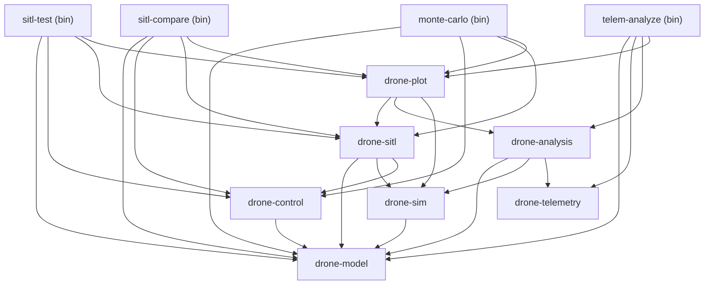

# Architektura drone-sim

## 1. Przegląd projektu

**drone-sim** to symulator lotu 6DOF (sześć stopni swobody) napisany w Rust. Obsługuje dwa modele pojazdów:

- **Quadrotor DJI Mini 3** — kwadrokopter w konfiguracji X-frame, z dynamiką silników pierwszego rzędu i oporem kwadratowym.
- **F-16A** — samolot bojowy z modelem aerodynamicznym NASA TP-1538, silnikiem turboodrzutowym F110 i pełną tablicą współczynników aerodynamicznych.

Projekt realizuje pełny pipeline symulacji: model fizyczny → pochodne stanu → integrator numeryczny → stan → regulator → wejście aktuatorów → powrót do modelu.

---

## 2. Struktura workspace

Workspace składa się z **7 crate'ów bibliotecznych** i **4 binarnych**.

### Crate'y biblioteczne (`crates/`)

- **`drone-model`** — rdzeń fizyki: stan drona (`DroneState`), modele pojazdów (`VehicleModel`), dynamika 6DOF, silniki, matematyka (atmosfera ISA, kąty Eulera), wrapper `TimeStep`.
- **`drone-control`** — regulatory lotu: PID, cascade PID, LQR, LQI, miksery (quadrotor/fixed-wing), profilery prędkości, trajektorie, trait `Controller`.
- **`drone-sim`** — silnik symulacji: trait `Integrator` (Euler, RK4), runner główny (`run`), konfiguracja `SimConfig`.
- **`drone-sitl`** — SITL (Software-In-The-Loop): scenariusze TOML, runner scenariuszy, zakłócenia (wiatr, turbulencja, awaria silnika), metryki, porównania regulatorów, Monte Carlo, raporty.
- **`drone-telemetry`** — parser plików telemetrycznych DJI SRT, konwersja GPS→ENU, normalizacja trajektorii.
- **`drone-analysis`** — walidacja modelu: wyrównanie trajektorii (alignment), porównanie symulacji z telemetrią, raporty walidacyjne.
- **`drone-plot`** — generowanie wykresów PNG (scenariusze, porównania, Monte Carlo, walidacja) za pomocą biblioteki `plotters`.

### Crate'y binarne (`bin/`)

- **`sitl-test`** — uruchamia scenariusze SITL z wybranym regulatorem (Cascade/LQR/LQI), sprawdza asercje, opcjonalnie generuje wykresy.
- **`sitl-compare`** — porównuje wielu regulatorów side-by-side na tych samych scenariuszach, generuje tabelę metryk i raporty Markdown.
- **`telem-analyze`** — waliduje model fizyczny względem rzeczywistej telemetrii DJI SRT, eksportuje CSV i wykresy.
- **`monte-carlo`** — uruchamia batch symulacji Monte Carlo z zaburzeniem warunków początkowych, raportuje statystyki metryk.

---

## 3. Graf zależności



Crate'y `drone-model` i `drone-telemetry` nie mają zależności wewnętrznych — stanowią liście grafu. Crate `drone-plot` jest najwyżej w hierarchii bibliotek, zależąc od `drone-sitl`, `drone-analysis` i `drone-sim`.

---

## 4. Przepływ danych

Pętla symulacji w każdym kroku czasowym `dt`:

```
┌─────────────────────────────────────────────────────────────┐
│                        Krok symulacji                       │
│                                                             │
│  1. Controller.update(state, target, dt) → ActuatorInput    │
│  2. VehicleModel.step_actuators(state, input, dt)           │
│     (dynamika silników pierwszego rzędu)                    │
│  3. VehicleModel.derivatives(state, input) → StateDot       │
│     (siły aero + grawitacja → dynamika 6DOF)                │
│  4. Integrator.step(model, state, input, dt) → new state    │
│     (Euler lub RK4)                                         │
│  5. state = new state; time += dt                           │
└─────────────────────────────────────────────────────────────┘
```

Szczegółowo:

1. **Regulator** oblicza wejście aktuatorów (`KnownActuatorInput`) na podstawie bieżącego stanu i celu lotu.
2. **Dynamika aktuatorów** (`step_actuators`) — filtr pierwszego rzędu modelujący opóźnienie silników (quadrotor) lub rozruch turbiny (F-16). Aktualizuje pole `actuator_state` w `DroneState`.
3. **Model pojazdowy** (`derivatives`) oblicza pochodne stanu: siły aerodynamiczne → siły i momenty w układzie ciała → `dynamics_6dof` (translacja + rotacja + pochodna kwaterniona).
4. **Integrator** (`Euler` lub `RK4`) stosuje pochodne do stanu, normalizując kwaternion po każdym kroku.

W pętli SITL dodatkowo na początku kroku aplikowane są **zakłócenia** (wiatr, turbulencja, awaria silnika).

---

## 5. Konwencje

### Układ współrzędnych
- **ENU** (East-North-Up): x = wschód, y = północ, **z = do góry**.
- Grawitacja: `[0, 0, -9.80665]` m/s² w układzie świata.
- Siły aerodynamiczne obliczane w układzie ciała (body frame), transformowane do świata przez kwaternion.

### Jednostki
- Układ **SI**: metry, sekundy, kilogramy, radiany.
- Prędkości kątowe silników: rad/s.
- Siła ciągu: newtony.
- Współczynniki: `k_thrust` [N·s²/rad²], `k_torque` [N·m·s²/rad²], `k_drag` [kg/m].

### Kwaternion
- `nalgebra::UnitQuaternion<f64>` — konwencja Hamilton (w, x, y, z).
- Reprezentuje rotację z układu świata do układu ciała.
- Po każdym kroku integracji kwaternion jest renormalizowany (`UnitQuaternion::from_quaternion`).
- Kąty Eulera (ZYX) dostępne wyłącznie do wizualizacji i porównania z telemetrią DJI.

### Krok czasowy
- `TimeStep` — newtype wrapper na `f64`, wymuszający `dt > 0` w czasie kompilacji/konstruktora.
- Metody: `new(dt) -> Result`, `constant(dt)` (panic przy <= 0), `seconds()`, `half()`.
- Uniemożliwia przypadkowe przekazanie ujemnego lub zerowego kroku.

---

## 6. Modele pojazdów

### QuadrotorModel (DJI Mini 3)

Kwadrokopter w konfiguracji X-frame z czterema silnikami:

```
  1(CCW)  0(CW)
     \   /
      [B]     ← nos (+x)
     /   \
  2(CW)  3(CCW)
```

Parametry fizyczne (`QuadrotorParams`):
- masa: 0.249 kg
- ramię: 0.085 m
- `k_thrust`: 1.526e-6 N·s²/rad²
- `k_torque`: 1.5e-8 N·m·s²/rad²
- `k_drag`: 0.15 kg/m (opór izotropowy kwadratowy)
- Tensor inercji: Ixx = Iyy = 3.4e-4, Izz = 6.8e-4 kg·m²

Dynamika silników: filtr pierwszego rzędu z `RotorParams` (stała czasowa, min/max prędkość). Efekt żyroskopowy wirników uwzględniony w momencie obrotowym.

Dwa warianty fabryczne:
- `QuadrotorModel::mini3()` — pełny model z atmosferą ISA i dynamiką wirników.
- `QuadrotorModel::mini3_simple()` — stała gęstość powietrza, bez wstępnego rozruchu wirników.

### F16Model (F-16A)

Model aerodynamiczny oparty na NASA TP-1538:
- Tablice współczynników aerodynamicznych (`aero_tables`) interpolowane po kącie natarcia (α) i liczbie Macha.
- Silnik turboodrzutowy F110 (`JetEngine`) z dynamiką pierwszego rzędu.
- Pełny tensor inercji (6 składników, uwzględniający produkty inercji Ixy, Ixz, Iyz).
- Atmosfera ISA z zależnością gęstości i prędkości dźwięku od wysokości.
- Moduł `trim` — wyznaczanie punktu równowagi dla danego trybu lotu.

Wejście sterujące: `KnownActuatorInput::FixedWing { throttle, aileron, elevator, rudder }`.

---

## 7. Regulatory

### Cascade PID (`CascadeController`)

Trójpoziomowy regulator kaskadowy:

1. **Pętla zewnętrzna** (pozycja → prędkość): `VelocityProfiler` (SqrtProfiler lub LinearProfiler) przelicza błąd pozycji na zadaną prędkość.
2. **Pętla środkowa** (prędkość → kąt/throttle): pętle PID na osiach vX, vY, vZ generują zadany kąt przechylenia/pochylenia oraz korektę ciągu.
3. **Pętla wewnętrzna** (kąt → wejście silników): pętle PID na roll, pitch, yaw generują komendy mikserowe, które `Mixer` (quadrotor lub fixed-wing) przelicza na konkretne wejścia aktuatorów.

Cechy: kompensacja pochylenia (tilt compensation), limit kąta przechylenia (`max_tilt_rad`), anti-windup na każdym PID.

### LQR (`LqrController`)

Regulator liniowo-kwadratowy:
- Linearyzacja modelu wokół punktu równowagi (`linearize`).
- Rozwiązanie algebraicznego równania Riccatiego (CARE) metodą flow + Newton.
- Macierz wzmocnień K ∈ ℝ^(m×n) stosowana jako `u = u₀ - K·(x - x₀)`.
- Limity aktuatorów (clamp na wyjściu).
- Stabilizuje wokół trimu — nie nadaje się do śledzenia zmiennych setpointów.

### LQI (`LqiController`)

Rozszerzenie LQR o 4 stany integralne [ξ_x, ξ_y, ξ_z, ξ_ψ]:
- Eliminuje błąd stanu ustalonego spowodowany niedopasowaniem modelu i stałymi zakłóceniami (opór, wiatr, spadek napięcia baterii).
- Stan rozszerzony: 13 stanów roślinnych + 4 integralne = 17D (quadrotor).
- Macierz wyjściowa C_int (4×13) wybiera integrowane wyjścia (x, y, z, ψ).
- Osie nieaktywne w `FlightTarget` mają zamrożone integratory (ξ̇ = 0).
- Anti-windup z konfigurowalnymi limitami `xi_limits`.

---

## 8. Scenariusze SITL

Scenariusze definiowane jako pliki TOML, ładowane przez `Scenario::from_file`. Struktura:

```toml
name = "step_response"
description = "Odpowiedź skokowa na wysokość 5m"
duration_s = 10.0
dt_s = 0.005
vehicle = "quadrotor_mini3"   # opcjonalne, domyślnie quadrotor_mini3

[initial]
position = [0.0, 0.0, 0.0]
velocity = [0.0, 0.0, 0.0]
attitude_deg = [0.0, 0.0, 0.0]

[target]
z = 5.0
x = 0.0    # opcjonalne
y = 0.0    # opcjonalne
yaw = 0.0  # opcjonalne

# Opcjonalna trajektoria (nadpisuje [target])
[trajectory]
type = "waypoint"    # hold | waypoint | circle
# ...

[[disturbances]]
type = "wind_gust"
# ...

[[assertions]]
metric = "position_rms_3d"
max = 0.5

[[assertions]]
metric = "settling_time_s"
max = 5.0
```

### Elementy scenariusza

- **`vehicle`** — wybór modelu: `quadrotor_mini3`, `quadrotor_mini3_simple`, `f16`.
- **`initial`** — warunki początkowe: pozycja, prędkość, orientacja (kąty Eulera w stopniach).
- **`target`** — statyczny cel lotu. `z` wymagane; `x`, `y`, `yaw` opcjonalne.
- **`trajectory`** — opcjonalna trajektoria zmienna w czasie:
  - `hold` — stały punkt.
  - `waypoint` — interpolacja liniowa między punktami z czasami.
  - `circle` — orbita kołowa (cx, cy, radius, omega, altitude).
- **`disturbances`** — lista zakłóceń: `wind_gust`, `turbulence`, `motor_failure`.
- **`assertions`** — warunki zaliczenia: metryki (`position_rms_3d`, `settling_time_s`, `overshoot_percent`, `control_energy`, itp.) z progami `max`.

### Konfiguracja regulatorów

Regulatory konfigurowane przez `ControllerConfig` (TOML z tagiem `type`):

```toml
# cascade
type = "cascade"
max_tilt_deg = 8.6
[vel_z]  kp = 0.3  ki = 0.1  ...
[att]    kp = 4.0  ki = 0.0  ...

# lqr
type = "lqr"
trim_z_m = 5.0
q_weights = [...]
r_weights = [...]

# lqi
type = "lqi"
trim_z_m = 5.0
q_weights = [...]  # 17 elementów (13 + 4 integralne)
xi_limits = [5.0, 5.0, 2.0, 6.28]
```

### Dostępne metryki

`PositionRms3d`, `PositionRmsAxis(X|Y|Z)`, `PositionMaxError3d`, `PositionMaxErrorAxis(X|Y|Z)`, `VelocityRms3d`, `VelocityRmsAxis(X|Y|Z)`, `AttitudeRms`, `AttitudeMaxError`, `OvershootPercent`, `SettlingTimeS`, `RiseTimeS`, `SteadyStateError`, `ControlEnergy`, `MaxControlRate`.
